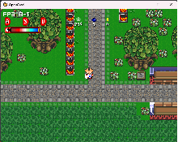
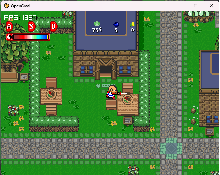

# OpenGraal

An open-source, experimental re-implementation of the classic Graal Online client using modern C++ and raylib.

OpenGraal aims to load legacy assets (levels, tiles, animations, sounds) and provide a lightweight playground for rendering maps, entities, and player animations in a standalone desktop app.

> This project is not affiliated with, endorsed by, or connected to Graal Online or its owners. All trademarks and assets belong to their respective owners.

## Features

- Cross-platform C++17 project using CMake + raylib
- Basic game loop, rendering, and input handling
- Level/tileset loading (`.graal` and `.nw` level files)
- Texture and sound resource management with simple caching
- Animation system with support for `.gani` files
- Simple entity/actor system (player, NPCs, signs)
- Example assets and a starter level for local testing

## Project status

- Early-stage and under development
- APIs and file/folder layout may change

## Requirements

- C++17-capable compiler (Clang, GCC, or MSVC)
- CMake 3.16+
- raylib (installed via your preferred package manager or from source)

Suggested install methods for raylib:
- macOS: `brew install raylib`
- Ubuntu/Debian: `sudo apt-get install libraylib-dev`
- Windows (vcpkg):
    - `vcpkg install raylib:x64-windows`
    - Configure CMake with `-DCMAKE_TOOLCHAIN_FILE=<vcpkg_root>/scripts/buildsystems/vcpkg.cmake`

## Screenshots

## Disclaimer

OpenGraal is a educational project designed to explore game programming patterns and legacy content pipelines. It is not associated with the original Graal Online. Please ensure you own the rights to any assets you use.
