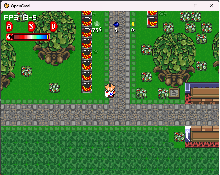
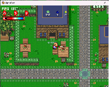

    

An open-source, experimental re-implementation of the Graal Online classic using modern C++ and Raylib.

 

> This project is not affiliated with, endorsed by, or connected to Graal Online or its owners. All trademarks and assets belong to their respective owners.

## Features

- Cross-platform C++23 project using CMake + raylib
- Basic game loop, rendering, and input handling
- Level/tileset loading (`.graal` and `.nw` level files)
- Texture and sound resource management with simple caching
- Animation system with support for `.gani` files
- Simple entity/actor system (player, NPCs, signs)
- Example assets and a starter level for local testing

## Project status

- Early-stage and under development
- APIs and file/folder layout may change

## Requirements

- C++23-capable compiler (Clang, GCC, or MSVC)
- CMake 4.1+
- raylib (fetched automatically by CMake)

## Screenshots

